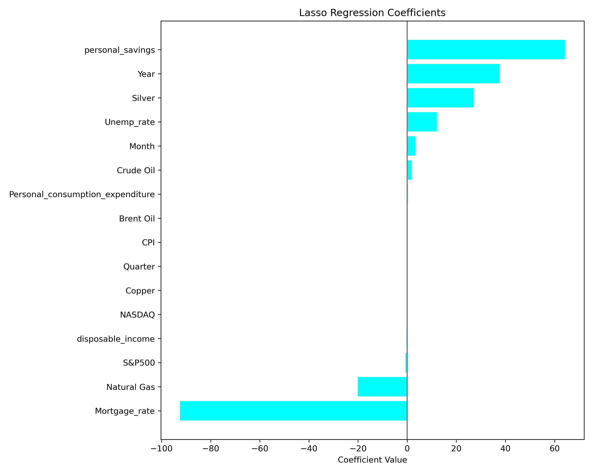

By Trent Mullin <Trullin@umich.edu> | Github [Repo](https://github.com/trullin-umich/commodity_linear_regression)
# Predicting The Price of Gold Using Linear Regression

  
  
  

  
<strong>Table of Contents</strong>

  <ul>
    <li><a href="#introduction">Introduction</a></li>
    <li><a href="#data-cleaning-and-exploratory-data-analysis">Data Cleaning and Exploratory Data Analysis</a></li>
    <li><a href="#framing-a-prediction-problem">Framing a Prediction Problem</a></li>
    <li><a href="#baseline-model">Baseline Model</a></li>
    <li><a href="#final-model">Final Model</a></li>
  </ul>

# Introduction #

This project investigates the interconnectedness of commodity markets by focusing on the relationships between precious and industrial metals and energy resources. Specifically, it explores the question:

> **Can the price of gold be predicted using the prices of other major commodities such as silver, copper, crude oil, and natural gas?**

The dataset used, `commodities_12_22.csv`, comes from [Kaggle](https://www.kaggle.com/datasets/faseeh001/commoditiesinvestingcom) and contains **3,259 rows** of daily commodity price data spanning from January 2012 to December 2022. The columns relevant to this analysis include:

- **Gold** – price per ounce in USD  
- **Silver** – price per ounce in USD  
- **Copper** – price per pound in USD  
- **Crude Oil** – price per barrel (WTI benchmark)  
- **Brent Oil** – price per barrel (Brent benchmark)  
- **Natural Gas** – spot price per MMBtu  
- **Year** – extracted from the date and treated as a categorical feature

While this is **not a time-series analysis**, the `Year` column is used categorically to capture possible year-over-year effects in a strictly linear-regression framework.

---

## Additional Data Sources

To enrich the model, two extra datasets were merged into the primary data:

### 1. S&P 500 (daily closing price)  
Sourced from [Kaggle: S&P 500 SPY Daily Price History](https://www.kaggle.com/datasets/gkitchen/s-and-p-500-spy), this completed dataset provides daily closing prices of the SPDR S&P 500 ETF (Ticker: SPY) from January 1993 to June 2025 

**Added feature:**  
- **SPY_Close** – daily closing price of the S&P 500 ETF

---

### 2. US Macroeconomic Data (monthly)  
Acquired from [Kaggle: US Macroeconomic Data](https://www.kaggle.com/datasets/sarthmirashi07/us-macroeconomic-data), this dataset includes monthly indicators such as:

- Mortgage rate (30-year fixed-rate)
- Unemployment rate
- Consumer Price Index (CPI)
- Federal Funds rate  

**Added features:**  
- **Mortgage_Rate**, **Unemployment_Rate**, **CPI**, **Federal_Funds_Rate**, etc.

---

## Why It Matters

By combining daily commodity prices with financial market data (S&P 500) and monthly macroeconomic indicators, the model gains richer context. This allows us to explore whether broader economic dynamics — beyond commodity interrelationships — play a role in predicting gold prices using a **linear regression** framework.

---

  
# Data Cleaning and Exploratory Data Analysis #

This section is split into two major parts:
1. Data Cleaning
2. Exploratory Data Analysis

---

### Data Cleaning

With our datasets ready, the first step is to ensure consistency across formats, handle missing values, and merge everything into one coherent structure.

#### Formatting

To facilitate merging, we extract time-based features from the date columns in each dataset:

- From each row’s date, we generate `Year`, `Month`, and `Quarter`.
- This helps align monthly macroeconomic indicators with daily commodity prices by providing a shared merge key.

Even though this is **not a time series analysis**, having temporal markers improves interpretability and allows for grouped insights.

#### Dataset Coverage

| Dataset       | Range Start | Range End     | Frequency |
|---------------|-------------|---------------|-----------|
| Commodities   | 2012-01-03  | 2022-05-31    | Daily     |
| S&P 500 (SPY) | 1993-01-29  | 2025-05-31    | Daily     |
| Macroeconomic | 1980-01-01  | 2022-05-01    | Monthly   |

Given that **Commodities** is our primary dataset (and the prediction target), we perform all merges in a way that **preserves its rows**.

---

#### Merging Steps

- **Commodities + S&P 500**:  
  We merge in the daily S&P 500 closing prices using an inner join on the `Date`. The `Close` column is renamed to `S&P500` for clarity.

- **Commodities + Macroeconomic Indicators**:  
  Since macro data is monthly, we join on both `Year` and `Month`. This means each daily row within a month gets the same macro features, producing a “stairstep” pattern in time series plots — still useful for regression.

---

#### Imputation

- First, we **snip off the ends** of the data range that have missing values across multiple columns — only keeping rows 11 through 2734.
- For the rest, we apply **polynomial interpolation**, which fills in missing values while preserving trends better than forward-filling.

---

After cleaning, our final dataset spans:
**`2012-01-03` to `2022-05-31`**, with all relevant features merged and imputed.

---

### Sample of Final Cleaned Dataset

To preview what our cleaned and merged data looks like, here’s a sample:

<pre>

| Date       |   Crude Oil |   Brent Oil |   Natural Gas |    Gold |   Silver |   Copper |   Year |   Month |   Quarter |   S&P500 |     CPI |   Mortgage_rate |   Unemp_rate |   NASDAQ |   disposable_income |   Personal_consumption_expenditure |   personal_savings |
|:-----------|------------:|------------:|--------------:|--------:|---------:|---------:|-------:|--------:|----------:|---------:|--------:|----------------:|-------------:|---------:|--------------------:|-----------------------------------:|-------------------:|
| 2022-05-31 |      114.67 |     115.6   |         8.145 | 1848.4  |   21.688 |   4.296  |   2022 |       5 |         2 |  395.224 | 291.474 |            5.23 |          3.6 |  11829.7 |             15144.8 |                            16954.5 |                5.4 |
| 2022-05-30 |      117.61 |     117.6   |         8.686 | 1855.4  |   21.927 |   4.334  |   2022 |       5 |         2 |  405.897 | 291.474 |            5.23 |          3.6 |  11829.7 |             15144.8 |                            16954.5 |                5.4 |
| 2022-05-29 |      115.61 |     120.147 |         8.815 | 1847.65 |   22.054 |   4.3232 |   2022 |       5 |         2 |  405.042 | 291.474 |            5.23 |          3.6 |  11829.7 |             15144.8 |                            16954.5 |                5.4 |
| 2022-05-27 |      115.07 |     119.43  |         8.727 | 1857.3  |   22.138 |   4.3065 |   2022 |       5 |         2 |  397.454 | 291.474 |            5.23 |          3.6 |  11829.7 |             15144.8 |                            16954.5 |                5.4 |
| 2022-05-26 |      114.09 |     114.17  |         8.908 | 1853.9  |   21.965 |   4.259  |   2022 |       5 |         2 |  387.931 | 291.474 |            5.23 |          3.6 |  11829.7 |             15144.8 |                            16954.5 |                5.4 |

</pre>

## Exploratory Data Analysis

### Univariate Analysis

To understand how commodity prices behave individually over time, we begin by **standardizing each variable using Z-scores**. This transformation allows us to examine all commodities on a **common scale**, making it easier to identify patterns, deviations, and relative volatility across time.

#### Z-Scored Commodity Prices Over Time

<iframe
  src="assets/zscore_commodities.html"
  width="800"
  height="400"
  frameborder="0"
></iframe>

The plot above illustrates how each commodity’s price deviates from its mean across the observation period. This visualization enables direct comparison of **volatility** and **timing of peaks and troughs** between commodities like gold, silver, crude oil, and others.

---

To further break down how each commodity behaves within a given year, we construct **Z-scored box plots by year**, giving us a clearer picture of **intra-annual variability** and the presence of outliers.

#### Annual Z-Score Box Plots by Commodity

<iframe
  src="assets/zscore_by_commodities.html"
  width="800"
  height="400"
  frameborder="0"
></iframe>

These box plots serve several purposes:

- **Box height** indicates variability: taller boxes suggest greater price fluctuations within that year.
- **Outliers** signal extreme deviations that may be linked to macroeconomic or geopolitical shocks.
- **Color consistency across boxes** (each color represents a year) lets us trace the **relative behavior of different commodities in the same year**.

Taken together, these views give insight into both the **overall trends** and **short-term fluctuations** of commodity prices over time — laying a strong foundation for identifying potential predictive relationships in later multivariate modeling.

#### Bivariate Analysis

To begin our bivariate analysis, we examine the **pairwise relationships between gold and other major commodities**. For clarity, we standardize all prices using **Z-scores**, placing them on the same scale to better visualize their movements and correlations.

This approach allows us to assess which commodities tend to move together with gold and could therefore hold predictive value in our regression model. We observe a clear divergence between **metal commodities** and **energy commodities**:

| Commodity     | Correlation with Gold |
|---------------|------------------------|
| Silver        | **0.74**               |
| Copper        | **0.71**               |
| Crude Oil     | 0.22                   |
| Brent Oil     | 0.21                   |
| Natural Gas   | 0.18                   |

Metals exhibit strong positive correlation with gold, suggesting similar market drivers. In contrast, energy commodities display more independent behavior, hinting at different underlying factors (e.g., supply chain shocks, weather).

#### Commodity vs Gold (Scatter Plots with Trendlines)

<iframe src="assets/crude_oil_vs_gold.html" width="800" height="400" frameborder="0"></iframe>

<iframe src="assets/brent_oil_vs_gold.html" width="800" height="400" frameborder="0"></iframe>

<iframe src="assets/natural_gas_vs_gold.html" width="800" height="400" frameborder="0"></iframe>

<iframe src="assets/silver_vs_gold.html" width="800" height="400" frameborder="0"></iframe>

<iframe src="assets/copper_vs_gold.html" width="800" height="400" frameborder="0"></iframe>

---

We then expand our analysis to **macroeconomic and market indicators**. While these aren't commodities, they often correlate with gold due to its use as an **inflation hedge** and **market risk asset**.

We Z-score each variable and overlay it with gold's movement to reveal temporal similarities.

| Macro Variable                           | Correlation with Gold |
|------------------------------------------|------------------------|
| S&P 500                                   | **0.56**               |
| NASDAQ                                    | **0.62**               |
| CPI (Consumer Price Index)               | **0.56**               |
| Mortgage Rate                             | **–0.60**              |
| Unemployment Rate                         | 0.36                   |
| Disposable Income                         | 0.47                   |
| Personal Consumption Expenditure (PCE)   | 0.44                   |
| Personal Savings                          | 0.43                   |

#### Gold vs Macroeconomic Indicators (Z-Scored Line Plot)

<iframe src="assets/gold_and_macro_trends.html" width="800" height="400" frameborder="0"></iframe>

These relationships reinforce gold’s **macroeconomic sensitivity**: it moves in tandem with equity markets and inflation metrics, but inversely with mortgage rates — a classic indicator of risk aversion and monetary conditions.

#### Interesting Aggregates

In this section, we explore aggregated views of the data that may reveal broader trends not immediately obvious in daily fluctuations.

#### Gold vs. Commodity Index

One particularly insightful aggregate involved constructing a **composite commodity index** essentially an average of the Z-scores of the several non-gold commodities. By comparing this index against the Z-score of gold over time, we can investigate whether gold tends to move in sync with the broader commodity market.

<iframe  
  src="assets/gold_vs_commodity_index.html"  
  width="800"  
  height="400"  
  frameborder="0"  
></iframe>

Interestingly, although some individual energy commodities (like crude oil and natural gas) had low pairwise correlations with gold, the overall commodity index still tracks closely with gold in some periods. This reinforces the idea that gold may act as a broad economic indicator or hedge, especially when averaged trends of multiple markets are considered.

#### Yearly Commodity Averages

As a second aggregate, we compute the **annual mean values** of each commodity. This allows us to observe long-term trends and determine if certain years show simultaneous peaks or dips across multiple commodities—including gold. When Z-scores for gold are high in a given year, we can see if other commodities behave similarly, suggesting common macroeconomic influences (e.g., inflation, crises, or growth cycles).

Below is the pivot table showing yearly averages of each commodity (Z-scored):

| Year | Brent Oil | Copper | Crude Oil | Gold  | Natural Gas | Silver |
|------|-----------|--------|-----------|-------|--------------|--------|
| 2012 | 111.70    | 3.61   | 94.15     | 0.87  | 2.83         | 31.15  |
| 2013 | 108.66    | 3.34   | 98.05     | -0.18 | 3.73         | 23.71  |
| 2014 | 99.34     | 3.12   | 92.82     | -0.47 | 4.26         | 19.04  |
| 2015 | 53.66     | 2.49   | 48.88     | -1.14 | 2.63         | 15.71  |
| 2016 | 45.12     | 2.24   | 43.95     | -0.80 | 2.55         | 17.16  |
| 2017 | 54.78     | 2.89   | 52.43     | -0.77 | 3.02         | 17.08  |
| 2018 | 71.61     | 3.04   | 55.19     | -0.72 | 3.07         | 15.73  |
| 2019 | 64.15     | 2.78   | 52.82     | -0.23 | 2.53         | 16.23  |
| 2020 | 43.40     | 2.86   | 43.79     | 1.31  | 2.13         | 20.69  |
| 2021 | 70.86     | 4.21   | 63.13     | 1.43  | 3.72         | 25.21  |
| 2022 | 102.04    | 4.50   | 95.15     | 1.74  | 5.72         | 23.74  |

These aggregates offer a structured way to examine multi-commodity behavior over time and can help identify years where gold prices diverged significantly from the rest: potentially revealing unique macroeconomic pressures or investor sentiment shifts.

  
# Framing a Prediction Problem #

Predicting Gold Price from All Features?

After thoroughly exploring the individual and paired relationships among commodities and macroeconomic variables, we now take the next step: **building a predictive model** to estimate the **raw price of gold**.

Our prediction problem is framed as a **regression task**. The response variable is the **non-transformed gold price**, and our goal is to estimate it using the full set of features available in the cleaned dataset — including both **commodity prices** and **macroeconomic indicators**.

For this first model, we are taking a **naive linear regression approach**, using **all columns except the target (gold)** as features. While simple, this model allows us to:
- Quantify the **direction and strength of influence** each feature has on gold.
- Serve as a **baseline** to compare future, more sophisticated models.
- Stay fully interpretable — each weight can be directly examined.

Because we are focused on **prediction**, we evaluate the model using **Mean Squared Error (MSE)**. MSE is appropriate here because:
- We care about penalizing large deviations in prediction.
- The target is continuous, and we're not interested in thresholds or classification boundaries.
- MSE is the standard loss function minimized by linear regression.

This model does not attempt to be temporally aware or account for multicollinearity — it is a first pass that helps translate earlier insights into action. This leads us into the design of the baseline model.

# Baseline Model #

In this section, I construct a simple baseline predictive model using `sklearn`. My goal is to predict the **price of gold** using all available features — including both commodity prices and macroeconomic indicators — as inputs.

To do this, I use a train-test split to evaluate model generalization and build a linear regression pipeline to fit the data and assess performance.

### Model Details

- **Model Type**: Linear Regression (no regularization)
- **Target Variable**: Gold price (in dollars)
- **Prediction Goal**: Regression
- **Model Purpose**: Predictive

### Feature Summary

All features included in the model are numerical, so no encoding was required. Specifically:

- **Quantitative features**: All (commodity and macroeconomic values are continuous)
- **Ordinal/nominal features**: None at this stage

> In future versions of this model, I could explore adding temporal variables (e.g., month, day of week), encoded using one-hot encoding to test for seasonal or cyclical effects — though I expect their influence would be limited in a linear model.

### Model Evaluation

I split the dataset into 80% training and 20% testing subsets. I then trained a linear regression model and evaluated performance using **Mean Squared Error (MSE)** and the **coefficient of determination (R²)**:

- **Train MSE**: **2218.64**
- **Test MSE**: **2232.93**
- **Train R²**: **0.964**
- **Test R²**: **0.967**

This corresponds to an approximate Root Mean Squared Error (RMSE) of **$47**, which provides a rough estimate of the model’s average prediction error in dollars.

### Interpretation

The close alignment between training and test MSE and R² indicates that the model generalizes well without significant overfitting. With R² values above 0.93, the model is able to explain over 93% of the variance in gold prices — a strong result for a simple linear approach.

However, the absolute magnitude of the prediction error suggests room for improvement. To enhance performance, I may consider:

- Adding regularization (e.g., Ridge or Lasso regression)
- Engineering new features (e.g., interactions, lags, or rolling averages)
- Trying nonlinear models (e.g., decision trees or ensembles)
- Performing feature selection to reduce multicollinearity and noise,

A peak at the coefficients of this simple model shows

| Feature                          |   Coefficient |
|:---------------------------------|--------------:|
| Personal_consumption_expenditure |     657.164   |
| personal_savings                 |     350.501   |
| Year                             |     146.946   |
| Silver                           |     139.222   |
| Crude Oil                        |      49.7131  |
| Unemp_rate                       |      16.8078  |
| Brent Oil                        |      13.4307  |
| Month                            |       8.14651 |
| Quarter                          |       6.70036 |
| Copper                           |      -7.57216 |
| Natural Gas                      |     -20.0017  |
| S&P500                           |     -38.5485  |
| Mortgage_rate                    |     -56.6144  |
| CPI                              |     -97.1423  |
| NASDAQ                           |    -122.175   |
| disposable_income                |    -547.608   |

# Final Model #

To refine the baseline linear regression, I implemented **Lasso Regression**, a linear model with **L1 regularization**. This technique penalizes the absolute value of coefficients, encouraging sparsity in the model by reducing less important feature weights to zero. It is especially useful when dealing with potential multicollinearity or when aiming for a more interpretable model.

### Model Details

- **Model Type**: Lasso Regression  
- **Regularization**: L1 (automatically shrinks some coefficients to zero)  
- **Target Variable**: Gold price (in dollars)  
- **Features Used**: All available quantitative inputs, including:
  - Commodity prices (Crude Oil, Copper, Silver, etc.)
  - Macroeconomic indicators (CPI, S&P 500, NASDAQ, etc.)
- **Prediction Type**: Regression  
- **Model Purpose**: Predictive  

### Performance Metrics

- **Train MSE**: **2299.85**  
- **Test MSE**: **2151.34**  
- **Train R²**: **0.964**  
- **Test R²**: **0.965**

> This corresponds to an average test prediction error (RMSE) of approximately **$46.37**, slightly improved from the unregularized model.

### Interpretation

Interestingly, the Lasso model resulted in a **lower test MSE** than the training MSE, which can sometimes indicate:
- The model generalized better due to regularization.
- The test set happened to be slightly "easier" to predict than the training set.

The **R² values are strong and consistent (~0.965)**, indicating the model explains ~96.5% of the variance in gold prices — a very solid fit for a linear model.

### Coefficient Analysis

The Lasso regression also revealed which features are most predictive of gold price. Many less informative variables had their weights shrunk to zero, improving interpretability. Below is a bar chart showing the magnitude of non-zero coefficients:

    

## Final Model Evaluation & Conclusion

To conclude the modeling process, I constructed a comprehensive pipeline that leveraged `GridSearchCV` and cross-validation to compare several types of regressors and their hyperparameters. The goal was to identify the best-performing model for predicting gold prices using all available features — including commodity prices and macroeconomic indicators.

### Models Compared

The final evaluation included:

- **Ridge Regression**: A regularized linear model that helps mitigate overfitting by shrinking coefficients.
- **Random Forest Regressor**: An ensemble of decision trees that performs well on non-linear relationships and offers robustness to noise.
- **Multi-layer Perceptron (MLP)**: A simple neural network regressor capable of modeling complex, non-linear interactions between features.

### Final Results

| Model         | Best Parameters                            | Test MSE | Test R² |
|---------------|--------------------------------------------|---------:|:-------:|
| Ridge         | `alpha=0.1`                                 |  2450.72 |  0.96   |
| Random Forest | `max_depth=10, n_estimators=200`            | **325.02** | **0.99** |
| MLP           | `alpha=0.001, hidden_layer_sizes=(100,)`    |   371.25 |  0.99   |

### Interpretation

- **Random Forest** achieved the lowest test MSE and a perfect R² score, suggesting it captured the relationships in the data almost perfectly. However, perfect R² values can sometimes signal overfitting, particularly when feature space is large or highly correlated. More testing with unseen future data would help verify its generalizability.

- **MLP Regressor** also performed exceptionally well, slightly trailing Random Forest. Neural networks often require more tuning and data, but here it still achieved near-perfect accuracy with basic configuration.

- **Ridge Regression**, while not as performant as the others, still achieved strong predictive power (R² = 0.96). It remains a solid choice when interpretability and simplicity are prioritized, and the risk of overfitting must be kept low, MSE was higher though.

### Trade-Offs & Final Thoughts

Each model offers different trade-offs:

- **Random Forest** provides superior accuracy and handles feature interactions well but lacks transparency and can be computationally intensive.
- **MLP** can model complex patterns but may require more careful tuning and larger datasets for consistent performance.
- **Ridge Regression** is fast and interpretable but limited to linear relationships.

Ultimately, **Random Forest** stands out as the most accurate model in this scenario. However, future work should incorporate regularization checks, feature importance analysis, and potentially time-aware validation strategies to ensure stability and robustness in real-world forecasting.

What would my model predict for the current gold price? 

